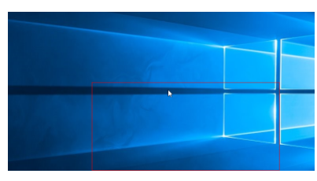

# this is about my first round

## while this is the next trial

### But i swear this will be the last

#### come on this is impossible for me

~~bite me~~
>hello
>hello

now let's try a new one
>hello
>>hello
>>>hello
>>>>no

and there can be another way to play
one`hello`one

```C++
I can do this
```

我甚至还可以这样：
[指导本md的教程](https://www.cnblogs.com/LuckyZLi/p/9776143.html#:~:text=%E4%BD%BF%E7%94%A8vs%20code%E7%BC%96%E5%86%99Markdown%E6%96%87%E6%A1%A3%E4%BB%A5%E5%8F%8Amarkdown%E8%AF%AD%E6%B3%95%E8%AF%A6%E8%A7%A3%201%20%E9%A6%96%E5%85%88%E5%AE%89%E8%A3%85vscode%E5%B7%A5%E5%85%B7%EF%BC%8C%E4%B8%8B%E8%BD%BD%E5%9C%B0%E5%9D%80%E5%A6%82%E4%B8%8B%EF%BC%9A%20https%3A%2F%2Fcode.visualstudio.com%2F%202%20%E5%9C%A8vs%20code%E7%9A%84%E6%89%A9%E5%B1%95%E4%B8%AD%E5%AE%89%E8%A3%85%EF%BC%9A,%2B%20K%EF%BC%8C%E7%84%B6%E5%90%8E%E6%94%BE%E6%8E%89%EF%BC%8C%E7%B4%A7%E6%8E%A5%E7%9D%80%E5%86%8D%E6%8C%89%20v%EF%BC%8C%E4%B9%9F%E8%83%BD%E8%B0%83%E5%87%BA%E5%AE%9E%E6%97%B6%E9%A2%84%E8%A7%88%E6%A1%86%E3%80%82%20%E3%80%90%E8%A6%81%E5%9C%A8%E8%8B%B1%E6%96%87%E8%BE%93%E5%85%A5%E7%8A%B6%E6%80%81%E4%B8%8B%E3%80%91%203.3%20%E7%9B%B4%E6%8E%A5%E7%82%B9%E5%87%BB%E5%BF%AB%E6%8D%B7%E5%9B%BE%E6%A0%87%20%E8%BF%98%E5%8F%AF%E4%BB%A5%E5%9C%A8%E9%A2%84%E8%A7%88%E6%95%88%E6%9E%9C%E7%9A%84%E7%95%8C%E9%9D%A2%E4%B8%AD%E5%8F%B3%E9%94%AE%E9%BC%A0%E6%A0%87%E9%80%89%E6%8B%A9%E5%9C%A8%E4%B8%8D%E5%90%8C%E5%B9%B3%E5%8F%B0%E9%A2%84%E8%A7%88%EF%BC%8C%E5%A6%82%E5%8F%AF%E4%BB%A5%E5%9C%A8%E6%B5%8F%E8%A7%88%E5%99%A8%E4%B8%AD%E9%A2%84%E8%A7%88%20)

还可以看图片呢！：


>还可以玩得再花一点：
[](https://www.cnblogs.com/LuckyZLi/p/9776143.html#:~:text=%E4%BD%BF%E7%94%A8vs%20code%E7%BC%96%E5%86%99Markdown%E6%96%87%E6%A1%A3%E4%BB%A5%E5%8F%8Amarkdown%E8%AF%AD%E6%B3%95%E8%AF%A6%E8%A7%A3%201%20%E9%A6%96%E5%85%88%E5%AE%89%E8%A3%85vscode%E5%B7%A5%E5%85%B7%EF%BC%8C%E4%B8%8B%E8%BD%BD%E5%9C%B0%E5%9D%80%E5%A6%82%E4%B8%8B%EF%BC%9A%20https%3A%2F%2Fcode.visualstudio.com%2F%202%20%E5%9C%A8vs%20code%E7%9A%84%E6%89%A9%E5%B1%95%E4%B8%AD%E5%AE%89%E8%A3%85%EF%BC%9A,%2B%20K%EF%BC%8C%E7%84%B6%E5%90%8E%E6%94%BE%E6%8E%89%EF%BC%8C%E7%B4%A7%E6%8E%A5%E7%9D%80%E5%86%8D%E6%8C%89%20v%EF%BC%8C%E4%B9%9F%E8%83%BD%E8%B0%83%E5%87%BA%E5%AE%9E%E6%97%B6%E9%A2%84%E8%A7%88%E6%A1%86%E3%80%82%20%E3%80%90%E8%A6%81%E5%9C%A8%E8%8B%B1%E6%96%87%E8%BE%93%E5%85%A5%E7%8A%B6%E6%80%81%E4%B8%8B%E3%80%91%203.3%20%E7%9B%B4%E6%8E%A5%E7%82%B9%E5%87%BB%E5%BF%AB%E6%8D%B7%E5%9B%BE%E6%A0%87%20%E8%BF%98%E5%8F%AF%E4%BB%A5%E5%9C%A8%E9%A2%84%E8%A7%88%E6%95%88%E6%9E%9C%E7%9A%84%E7%95%8C%E9%9D%A2%E4%B8%AD%E5%8F%B3%E9%94%AE%E9%BC%A0%E6%A0%87%E9%80%89%E6%8B%A9%E5%9C%A8%E4%B8%8D%E5%90%8C%E5%B9%B3%E5%8F%B0%E9%A2%84%E8%A7%88%EF%BC%8C%E5%A6%82%E5%8F%AF%E4%BB%A5%E5%9C%A8%E6%B5%8F%E8%A7%88%E5%99%A8%E4%B8%AD%E9%A2%84%E8%A7%88%20)

下面来尝试一些更新的东西：序列！

* one
* two
* three
* four
  
1. one
2. two
3. three
4. four
   1. one
   2. two
   *this is not good
再来看看下面的你喜欢哪个：

    * [ ] 选项一
    * [x] 选项二

怎么样，是不是很好玩:joy::smirk::kissing:

注： : 代表对齐方式

| a | b |
|:--|--:|
|左对齐|右对齐|

>下面我们来尝试一下语义标记:  

*斜体*或者
**加粗**
***斜体+加粗***
~~删除~~
==背景色==
$\underline{下划线}$
^suscribe^
suscribe - suscribe
~suscribe~

<kbd>ctrl<kbd>

***
this
***
markdown[^1]
[^1]:this is my first so great

[formula](#1)

####  {#1}

markdown
    :  轻量级文本标记语言

<lixiang22@mails.tsinghua.edu.cn>